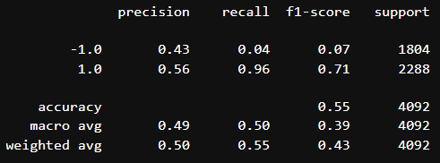
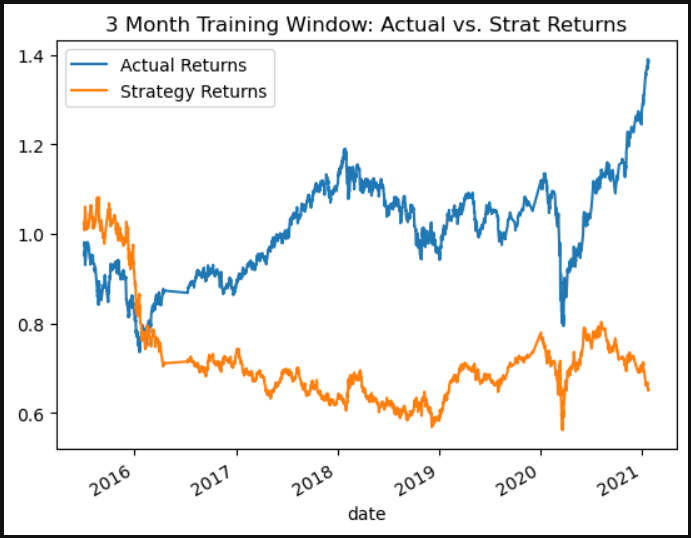
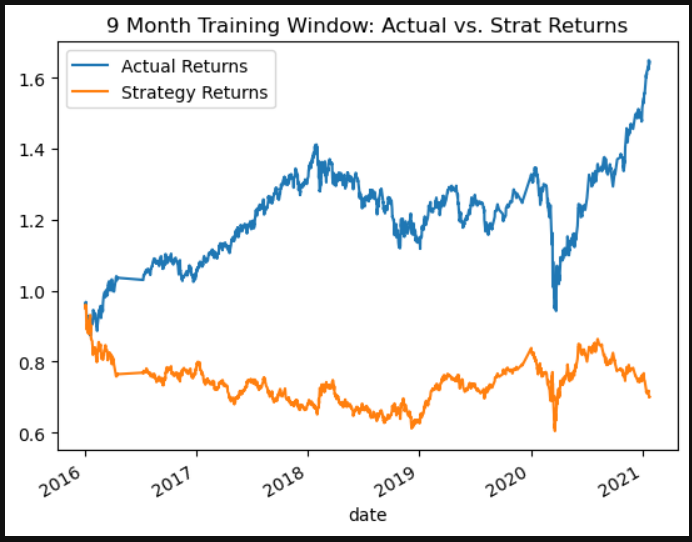
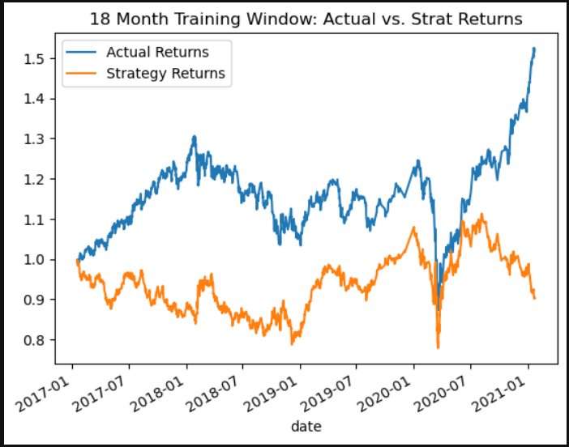
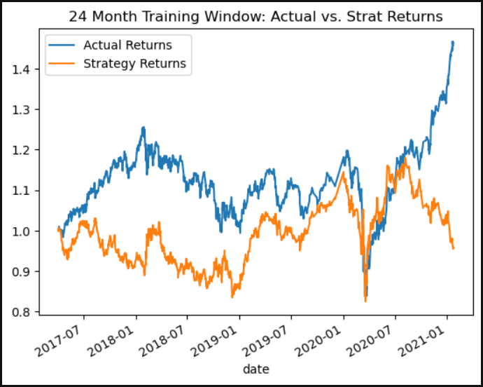
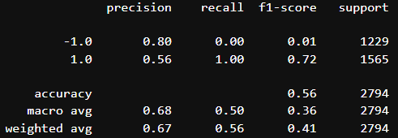
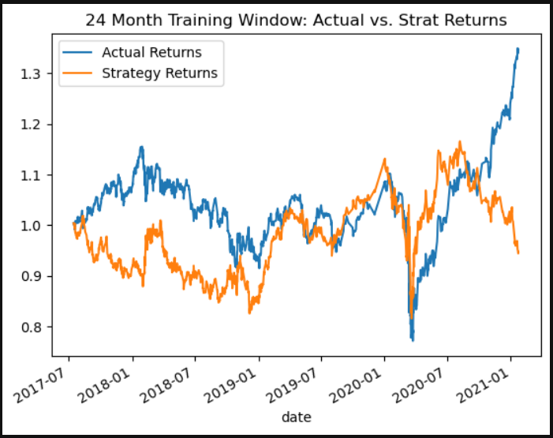
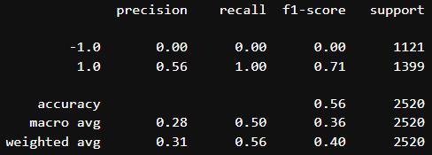
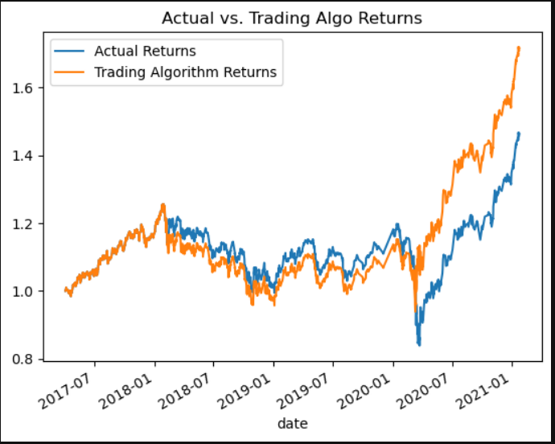
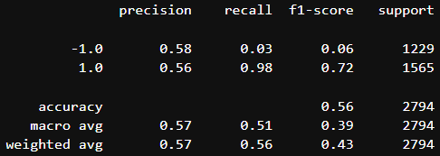

# **Module 14 Homework**

## Establishing a Baseline Performance
To establish our baseline performance the dataset was imported and we applied a short and long view of 4 and 100 days respectively with a three-month training window.  

Applying the logic above within the support vector machine learning method created a moderately accurate prediction (55%) and precision scores of 43% and 56% percent.

## Tuning the Algorithm
Following the development of our baseline model, I tuned the model using a variety of short and long views as well as different training windows. 

Doing so created noticeable changes in percision and accuracy; however, in some cases it created errors/warnings with the output. The 24 month training window coupled with the expanded SMA resulted in an error leading to zero value -1.0 precision. 

### 9 Month Training Window
 

### 18 Month Training Window; 10 and 250 Simple Moving Average
 

### 24 Month Training Window
 

### 24 Month Training Window; 75 and 250 Simple Moving Average
After testing a number of different training windows and SMA variations, the 24 month training window with a 75 and 250 SMA appeared to perform slightly better than the 3 month baseline.

 

## Evaluating a New Machine Learning Model
As an alternative method, I used the LogisticRegression classifier to try and identify a better model. The alternative yielded a better accuracy score than the baseline, and the same accuracy score as the tuned model.

### Log Model Ouput

